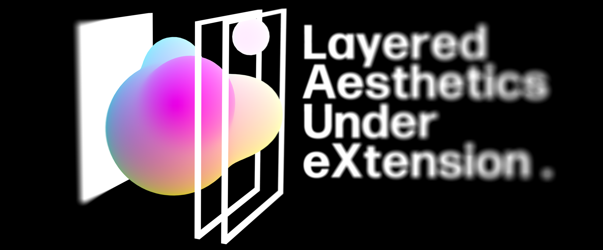

  

# SimpleMix

**SimpleMix** is a lightweight Unity / VRChat world audio mixing toolkit for building layered ambience and zone-based transitions, and simple SFX triggers.

[中文说明](README.zh-CN.md)

## Quick Start

Use `LAuX > Simple Mix > Setup Scene` to create the runtime authoring structure. Put loop AudioSources under `Layers`, SFX AudioSources under `SFX`, then author snapshots and triggers from the SimpleMix inspectors.

Optional debug UI can be placed with `LAuX > Simple Mix > Place Debug Panel`.
